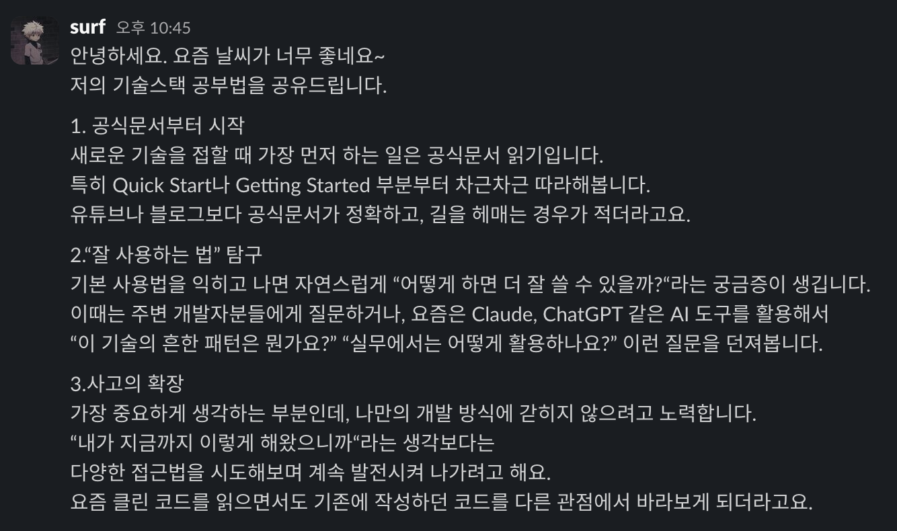

# TIL (Today I Learned)

**날짜:** 2025.06.04

## 📖 오늘 읽은 범위

**7장. 오류처리**

## 💡 책에서 기억하고 싶은 내용

> **Try-Catch-Finally 문부터 작성하라** - 먼저 강제로 예외를 일으키는 테스트 케이스를 작성한 후 테스트를 통과하게 코드를 작성하는 방법을 권장한다. 그러면 자연스럽게 `try` 블록의 트랜잭션 범위부터 구현하게 되므로 범위 내에서 트랜잭션 본질을 유지하기 쉬워진다. (p.133)

> **예외에 의미를 제공하라** - 오류 메시지에 정보를 담아 예외와 함께 던진다. 실패한 연산 이름과 실패 유형도 언급한다. 애플리케이션이 로깅 기능을 사용한다면 `catch`블록에서 오류를 기록하도록 충분한 정보를 넘겨준다. (p.135)

> **정상 흐름을 정의하라** - 특수 사례 패턴 - 클래스를 만들거나 객체를 조작해 특수 사례를 처리하는 방식이다. 그러면 클라이언트 코드가 예외적인 상황을 처리할 필요가 없어진다. 클래스나 객체가 예외적인 상황을 캡슐화해서 처리하므로. (p.138)

> **null을 반환하지 마라** - `null`을 반환하는 코드는 일거리를 늘릴 뿐만 아니라 호출자에게 문제를 떠넘긴다. 누구 하나라도 `null` 확인을 빼먹는다면 애플리케이션이 통제 불능에 빠질지도 모른다. (p.139)

> **null을 전달하지 마라** - 매서드에서 `null`을 반환하는 방식도 나쁘지만 메서드로 `null`을 전달하는 방식은 더 나쁘다. 정상적인 인수로 `null`을 기대하는 API가 아니라면 메서드로 `null`을 전달하는 코드는 최대한 피한다. (p.140)

> **결론** - 깨끗한 코드는 읽기도 좋아야 하지만 안정성도 높아야 한다. 이 둘은 상충하는 목표가 아니다. 오류 처리를 프로그램 논리와 분리해 독자적인 사안으로 고려하면 튼튼하고 깨끗한 코드를 작성할 수 있다. 오류 처리를 프로그램 논리와 분리하면 독립적인 추론이 가능해지며 코드 유지보수성도 크게 높아진다. (p.142)

## 🤔 오늘 읽은 소감

- "예외에 의미를 제공하라"는 원칙이 공감되었다. 개발할 때 콘솔에 단순히 `error`만 찍는 경우가 많았는데, 어떤 함수에서 어떤 이유로 실패했는지 구체적인 정보를 남기는 것이 디버깅에 훨씬 도움이 될 것 같다.

- API 호출 시 `try-catch`를 사용하지만 주로 에러 발생 후 처리에만 집중했었다. "Try-Catch-Finally 문부터 작성하라"는 접근 방식처럼 에러 상황을 먼저 고려하고 코드를 작성하는 습관을 들여야겠다.

## ❓ 궁금한 내용

Q. Optional Chaining(`?.`)과 Nullish Coalescing(`??`)은 클린 코드에서 말하는 "null을 피하라"는 원칙과 어떻게 연결될까?

A. 내 생각엔 이 문법들은 그 원칙을 어기지 않는다. 오히려 불가피한 `null` 상황을 안전하게 처리하도록 돕는 도구라고 본다.

클린 코드는 가능한 한 `null`을 만들지 말고, 기본값이나 특수 객체로 대체하라고 한다. 반면 `?.`와 `??`는 이미 null이 존재하는 상황에서 코드가 복잡해지거나 깨지지 않도록 도와준다.

```js
const username = user?.profile?.name ?? "Anonymous";
```

이건 확실히 읽기 쉽고 안전하다.
하지만 더 클린한 설계는 `user`와 `profile`이 `null`이 되지 않도록 구조를 잡는 것이다.

결론: `?.`, `??`는 근본적인 해결책은 아니지만, 현실적인 코드에서 `null`을 깔끔하게 다루게 해주는 실용적인 보완 도구라고 생각한다.

## 💁 나만의 공부법


