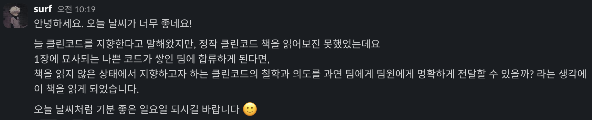

# TIL (Today I Learned)

**날짜:** 2025.05.25

## 📖 오늘 읽은 범위

**2장. 의미 있는 이름**

## 💡 책에서 기억하고 싶은 내용

> 변수나 함수 그리고 클래스 이름은 다음과 같은 굵직한 질문에 모두 답해야 한다. 변수(혹은 함수나 클래스)의 존재 이유는? 수행 기능은? 사용 방법은? 따로 주석이 필요하다면 의도를 분명히 드러내지 못했다는 말이다. (p.22)

> 프로그래머는 코드에 그릇된 단서를 남겨서는 안 된다. 그릇된 단서는 코드 의미를 흐린다. 나름대로 널리 쓰이는 의미가 있는 단어를 다른 의미로 사용해도 안 된다. (p.24)

> 추상적인 개념 하나에 단어 하나를 선택해 이를 고수한다. 예를 들어, 똑같은 메서드를 클래스마다 `fetch`, `retrieve`, `get`으로 제각각 부르면 혼란스럽다. 일관성 있는 어휘는 코드를 사용할 프로그래머가 반갑게 여길 선물이다. (p.33)

> 프로그래머는 코드를 최대한 이해하기 쉽게 짜야 한다. 집중적인 탐구가 필요한 코드가 아니라 대충 훑어봐도 이해할 코드 작성이 목표다. (p.34)

> 클래스, 함수, 이름 공간에 넣어 맥락을 부여한다. 모든 방법이 실패하면 마지막 수단으로 접두어를 붙인다. (p.35)

> 맥락을 개선하면 함수를 쪼개기가 쉬워지므로 알고리즘도 좀 더 명확해진다. (p.36)

> 여느 코드 개선 노력과 마찬가지로 이름 역시 나름대로 바꿨다가는 누군가 질책할지도 모른다. 그렇다고 코드를 개선하려는 노력을 중단해서는 안 된다. (p.38)

## 🤔 오늘 읽은 소감

- 변수나 함수에 주석을 단 경험이 여러 차례 있었다. 주석 없이는 이해하기 어려운 코드를 작성했다는 것은, 결국 의도를 분명히 드러내지 못했다는 것임을 깨달았다.

- 맥락을 부여하는 관점이 꽤 와닿았다. 프론트엔드에서 컴포넌트를 설계할 때 어디까지 추상화해야 할지 고민이 많았는데, 먼저 명확한 맥락을 부여하고 나서 기능별로 쪼개는 접근 방식을 시도해 봐야겠다.

## ❓ 궁금한 내용

나는 API를 통해 데이터를 받아올 때 API response의 필드명과 변수명을 동일하게 사용하는 경우가 많다.

이는 이 책의 34페이지 "문제 영역에서 가져온 이름을 사용하라"라는 원칙과 같은 맥락으로 이해하면 될까?

## 💁 이 책을 읽으려는 이유

